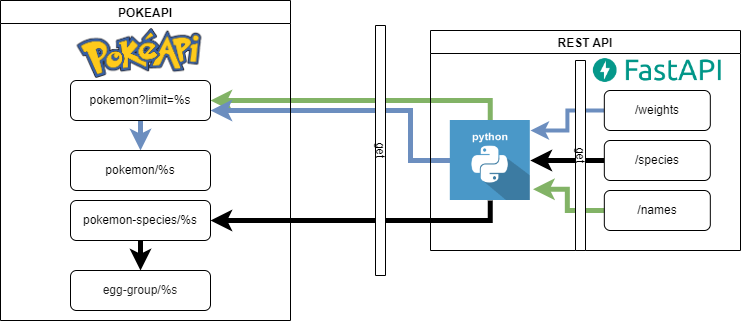

# pokeapi-rest

all data is being gathered from PokéAPI (https://pokeapi.co/).

the repo consist in 3 main functions.

```
amount_match_names: return the amount of pokemons that contain `at` plus another `a` in their name
this function parameter is customizable 

amount_breeding_especies: return the amount of pokemon that belong to the same species than the input
pokemon, based on the egg_group of the first entry
this parameter is customizable and can receive both pokemon name or number

minmax_weights: return a list with the max and min value of weights of an fighting pokemon type
limited by a range of ids (151 by default) 
this range is custom
```

### Diagram
[]()
 
the project was uploaded at heroku, using fastapi.
the responses can be tested at https://pokeapi-seba.herokuapp.com/

`https://pokeapi-seba.herokuapp.com/names`
`https://pokeapi-seba.herokuapp.com/species`
`https://pokeapi-seba.herokuapp.com/weights`

for further documentation go to 

`https://pokeapi-seba.herokuapp.com/docs`